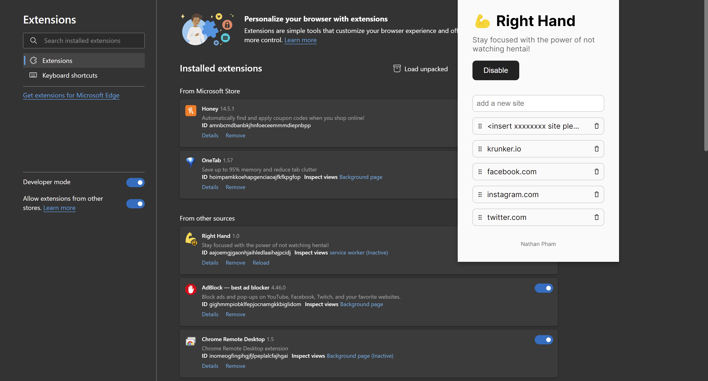

# Right Hand

Stay focused with the power of not watching hentai!

## No, Seriously

"Power Work" is a Chrome extension that allows you to block sites at a network request level. It features an editable list of websites (don't ask how I got the list, Github Copilot wrote it ok?) and a global enable/disable button. I'm pretty disappointed that all major extensions require you to pay to add more than a few sites, so I made my own. Hopefully this helps with anyone's social media or browsing addiction (though you will probably want to mod the `/js/config.js` file & remove the enable/disable button).

## Screenshots

